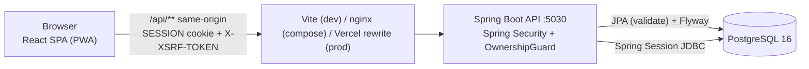
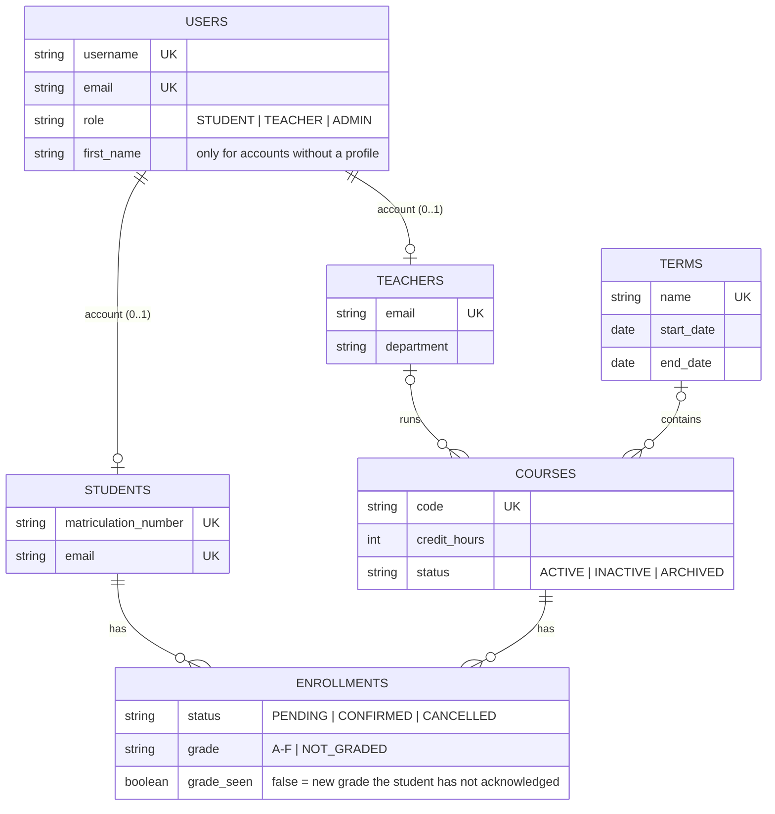
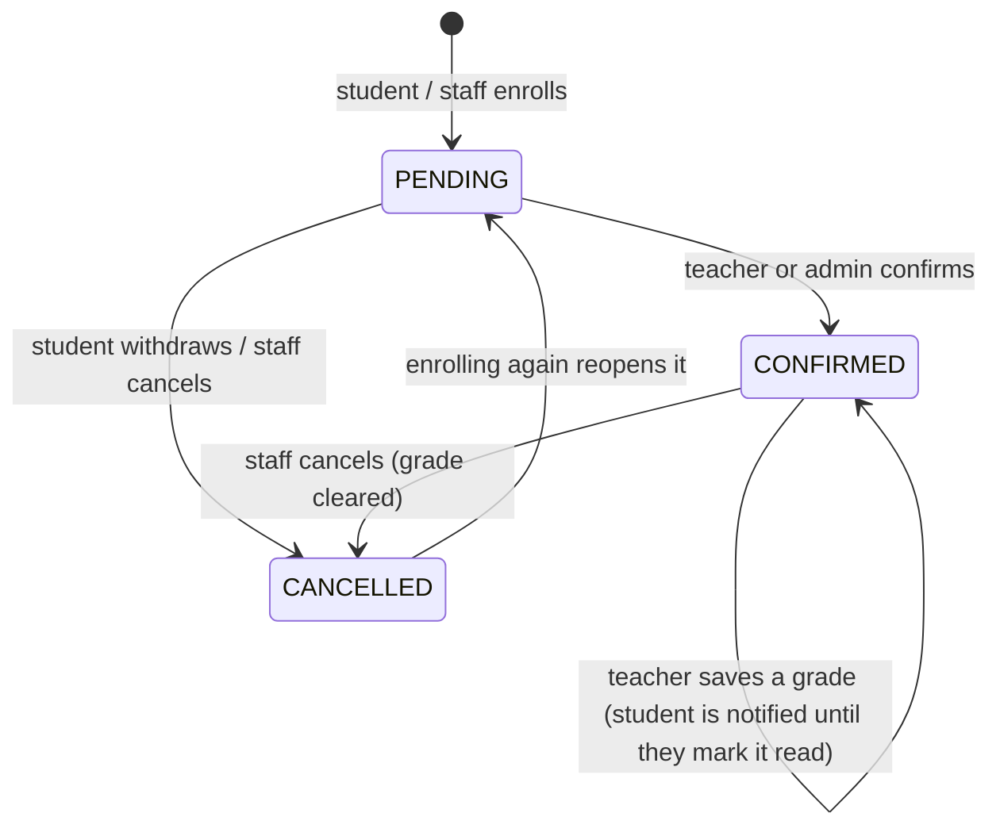

# Architecture

The current shape of the system. The design-phase diagrams and PDFs in
`backend/student-manager/docs/` and `docs/student-manager-diagrams.drawio` predate several
changes (see [Superseded documents](#superseded-documents)); this file is kept in step with the code.

## Runtime

- Authentication is a server-side session: login sets an HttpOnly `SESSION` cookie whose
  data lives in the `spring_session` tables. There is no token in the browser.
- CSRF: the API sets an `XSRF-TOKEN` cookie; axios echoes it in `X-XSRF-TOKEN` on writes.
- The schema is owned by Flyway (`db/migration`); Hibernate only validates it.

## Data model

Every table also carries `id`, audit columns (`created_at/by`, `updated_at/by`) and an
optimistic-lock `version`. `(student_id, course_id)` is unique on enrollments.

## Who may do what

The authoritative rules are `SecurityConfig` (role per route) and `OwnershipGuard` (ownership
per record). The README has the full endpoint table; in short:

| Concern | Rule |
|---|---|
| Course create | TEACHER (becomes its teacher) or ADMIN (picks teacher and term) |
| Course edit / delete | ADMIN, or the TEACHER who runs it |
| Enrollment list | ADMIN: all. TEACHER: only enrollments in their courses |
| Enroll | STUDENT: themselves. TEACHER: into their courses. ADMIN: anyone |
| Confirm / grade | ADMIN, or the course's TEACHER |
| Cancel | ADMIN, the course's TEACHER, or the owning STUDENT while `PENDING` |
| Students / teachers | TEACHER and ADMIN read, only ADMIN writes |
| Accounts | created by ADMIN only |

## Enrollment lifecycle

## Superseded documents

These were produced during the design phase and are **not** regenerated with the code:

- `backend/student-manager/docs/student-manager-class-diagram.drawio` and the two UML PDFs
  still show the removed `RegistrationInvite` flow and JWT.
- `backend/student-manager/docs/student-manager-system-overview.*` and
  `docs/student-manager-diagrams.drawio` still describe JWT bearer authentication
  (now session cookies) and `ddl-auto=update` (now Flyway).
- `student-manager-db-design.pdf` and `student-manager-functional-requirements.pdf` predate
  Flyway, teacher-owned courses and the student withdraw flow.

Use this file and the README as the source of truth.
